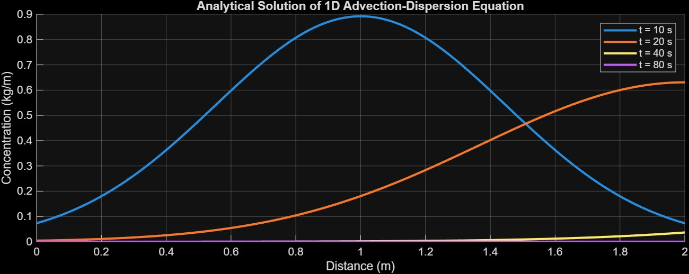
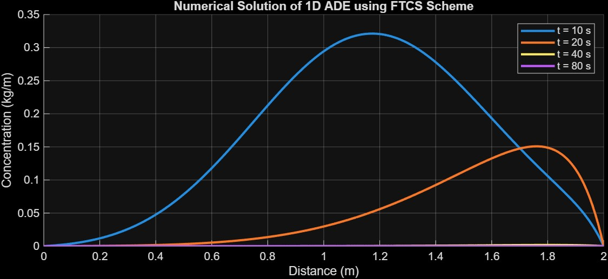

# 1D Advection–Dispersion Modeling (Analytical vs. Numerical)

This project presents **analytical** and **finite-difference (FTCS)** numerical solutions to the **one-dimensional Advection–Dispersion Equation (ADE)** for solute transport.  
Developed as part of my MSc coursework *“Numerical Modelling in Water and Sediment Transport”* at **IWFM, BUET**.

---

##  Overview

The Advection–Dispersion Equation (ADE) describes solute movement under the combined effects of **advection** and **dispersion**:

∂C/∂t + u·∂C/∂x = D·∂²C/∂x²

Two approaches are implemented:
1. **Analytical solution** for a pulse input.  
2. **Numerical solution** using the **Forward-Time Central-Space (FTCS)** finite-difference scheme.

The numerical model is validated against the analytical profile to assess **stability**, **dispersion**, and **temporal evolution**.

---

## ⚙️ Parameters

| Symbol | Description | Default |
|:--|:--|:--|
| L | Domain length (m) | 2.0 |
| D | Dispersion coefficient (m²/s) | 0.01 |
| u | Advection velocity (m/s) | 0.1 |
| nx | Grid points | 200 |
| dt | Time step (s) | 0.001 |

---

##  Results

### Analytical Solution
The analytical solution shows smooth Gaussian concentration profiles that advect and disperse over time.

---

### Numerical Solution (FTCS Scheme)
The FTCS numerical model reproduces the solute transport behavior with acceptable accuracy when stability criteria are maintained (α ≤ 0.5).

---

## 📁 Files

| File | Description |
|------|--------------|
| `ADE_analytical.m` | Analytical solution for a pulse input |
| `ADE_numerical_FTCS.m` | Finite-difference solution using FTCS |
| `assets/` | Contains output figures and plots |

---

##  Author

**Md. Asadullahil Galib Fardin**  
Research Assistant, IWFM, BUET  
📧 [fardin.civilworks@gmail.com](mailto:fardin.civilworks@gmail.com)  
🌐 [github.com/galibfardeen](https://github.com/galibfardeen)
